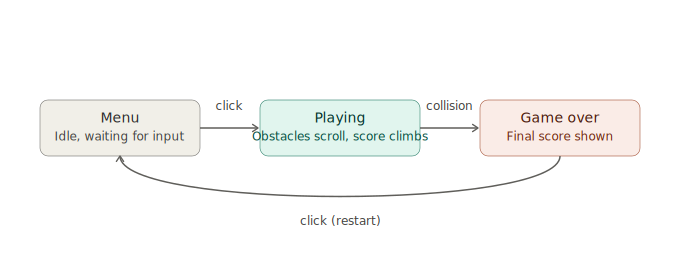
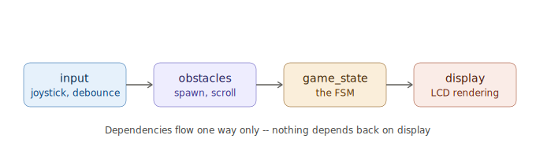

# Lane Dodger

A two-lane obstacle-dodging game built for the Arduino UNO R3, displayed on a 16x2 character LCD and controlled with an analog joystick.



## Why this exists

This started as an exercise in pairing a microcontroller project with real software architecture: a finite state machine, separated input/logic/rendering layers, and a fixed memory footprint, rather than a single `loop()` function that does everything. It also turned into a useful case study in debugging hardware-timing bugs that don't show up in the logic at all -- several of the bugs below only appeared once real LCD write latency entered the picture.

## How to play

- The player sits in either the top or bottom row of the display, marked with `>`.
- Obstacles (`#`) scroll in from the right and move left every tick.
- Push the joystick up or down to switch lanes and dodge.
- Score climbs the longer you survive; the game speeds up gradually over roughly the first 50 seconds, then holds at a fixed top speed.
- Colliding with an obstacle ends the run. Click the joystick button to return to the menu and try again.

## Hardware

- Arduino UNO R3
- 16x2 character LCD (HD44780-compatible, parallel interface -- no I2C backpack)
- Analog joystick module (X/Y potentiometer + click button)
- 10k potentiometer for LCD contrast
- Breadboard and jumper wires

### Wiring

| Component | Pin | UNO pin |
|---|---|---|
| LCD | VSS | GND |
| LCD | VDD | 5V |
| LCD | V0 | Contrast pot wiper |
| LCD | RS | 7 |
| LCD | RW | GND |
| LCD | E | 6 |
| LCD | D4 | 5 |
| LCD | D5 | 4 |
| LCD | D6 | 3 |
| LCD | D7 | 2 |
| LCD | A / K (backlight) | 5V / GND |
| Joystick | VRy | A0 |
| Joystick | SW | 8 (`INPUT_PULLUP`) |
| Joystick | VCC / GND | 5V / GND |

LCD pins D0-D3 are unused (4-bit mode). RW must be tied to GND -- leaving it floating caused intermittent display corruption during development (see below).

## Software architecture

```
lane-dodger-arduino/
├── README.md
├── docs/
│   ├── fsm_diagram.svg
│   └── architecture_diagram.svg
└── src/
    ├── runner.ino       setup() + loop(), wires the modules together
    ├── input.h/.cpp      joystick reading, debouncing, button edge detection
    ├── obstacles.h/.cpp   obstacle array: spawning, scrolling, collision queries
    ├── game_state.h/.cpp  the finite state machine and score/difficulty logic
    └── display.h/.cpp     all LCD rendering
```

To build: copy everything inside `src/` into a single Arduino IDE sketch folder named `runner` (the `.ino` filename must match the folder name).



Each module only knows about the ones before it in the chain. `display` has no idea how the joystick is wired; `obstacles` has no idea what's on screen. This made each bug below isolatable to a single file once it was understood.

### The state machine

Three states, three transitions:

- **Menu** -> **Playing** on a button click
- **Playing** -> **Game over** on collision
- **Game over** -> **Menu** on a button click

`game_state.cpp` owns this transition logic and nothing else -- it has no knowledge of LCD pins or joystick wiring, only an `InputManager` and an `ObstacleManager` it queries each tick.

### Memory-constrained design choices

- **No dynamic allocation.** Obstacles live in a fixed-size array (`MAX_OBSTACLES = 4`), not a linked list or `std::vector`. On a target with 2KB of RAM, avoiding `malloc`/`new` avoids both fragmentation and an entire class of bugs.
- **Compiled footprint**: roughly 5.5KB flash (17% of the UNO's 32KB) and 151 bytes of global RAM (7% of 2KB), leaving the rest for the call stack. Checked with every build via the Arduino IDE's compile output, not assumed.

## Bugs found during development (and what they taught me)

Building this surfaced several bugs that only existed because of real hardware constraints -- they would never appear in a desktop simulation of the same logic. Documenting them here because the debugging process was the most useful part of the project.

### 1. Smearing during obstacle movement

**Symptom:** characters looked smeared or double-printed as obstacles moved.

**Cause:** the main loop redrew the entire play area on every iteration (~every 10ms), but obstacles only moved once per tick interval (hundreds of ms). The LCD was being asked to repaint a full row up to ~40 times for every actual movement -- far more often than the hardware could physically keep up with, so writes were landing while a previous write was still in progress.

**Fix:** cache the last-rendered row content and only write to the LCD when something actually changed.

### 2. Blurring that got worse as the game sped up

**Symptom:** even after fix #1, obstacles appeared "in multiple places at once" specifically as difficulty increased.

**Cause:** the difficulty ramp's minimum tick interval (120ms) was short enough that, combined with the LCD's real write latency, the next obstacle movement could be computed before the previous frame had finished painting.

**Fix:** raised the difficulty floor to 200ms and added an explicit minimum gap between LCD writes as a second line of defense, independent of the game-logic timing.

### 3. Per-character flashing on every move

**Symptom:** motion looked like a flash across the row rather than a clean step.

**Cause:** even with change-detection, each tick still rewrote the *entire* row string whenever anything in it changed, which meant ~11 characters re-sent to the LCD for what was usually a 1-2 character change.

**Fix:** diff at the character level instead of the row level, writing only the specific cells that changed. This cut typical writes-per-tick from 11 characters to 1-3.

### 4. Stale text bleeding through from the previous screen

**Symptom:** leftover menu text ("DODGER", later "PRES") stayed visible after gameplay started.

**Cause:** two different versions of this bug, both from the same underlying issue -- something writing outside its assigned region of the display with no other code responsible for clearing it:
- The play area's change-detection cache only knew what *it* had written, not what was physically on the LCD. If a cell's first real frame happened to want a blank space and the cache already defaulted to blank, no write was issued, leaving menu text sitting underneath.
- A region of the screen (row 1, score columns) wasn't owned by either the score renderer (row 0 only) or the play area (different columns), so nothing ever cleared it.

**Fix:** force every play-area cell to write on the first frame after a screen transition, regardless of whether the cache thinks it changed. Explicitly clear the orphaned region once per game start.

### 5. Obstacles stuck on screen after they should have moved or disappeared

**Symptom:** some `#` characters remained on screen indefinitely, even after the obstacle had moved away.

**Cause:** the rate-limiting gate that prevents writing to the LCD too frequently was being re-checked *inside* the per-cell loop. The first cell write in a row would update the gate's timestamp, which then immediately closed the gate for the very next cell in the same call -- abandoning it mid-row. Since a single obstacle's movement always changes at least two cells (the column it left, the column it entered), this meant the "clear the old position" write was routinely dropped, and the cache never recorded that anything was wrong there.

**Fix:** decide the rate-gate once per row, before the loop starts, not per cell. Either the whole row's real changes go through together, or none do.

## Known limitations

- A parallel character LCD has no concept of shifting existing content -- every movement is a full repaint of whatever cells changed, not a true visual "slide." This is a hardware constraint, not a remaining bug.
- Score display is capped at 999 to fit the reserved 5-column region; values beyond that clamp rather than overflow.

## Possible extensions

- Sound effects via a piezo buzzer on collision/score events (flash headroom is currently at ~83% free, plenty of room)
- A second obstacle lane pattern or moving target for variety
- Persisting a high score in EEPROM across power cycles
